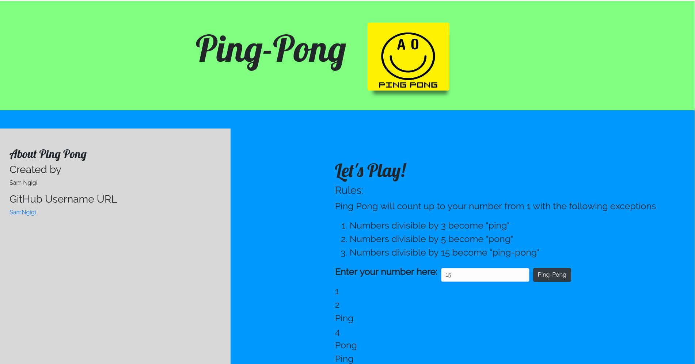

PingPong Game
=======================

**This simple game website where the user inputs a number in the blank space provided and then multiples of 3 output "Ping", multiples of 5 ouput "Pong" and multiples of 3 and 5 output "Ping-Pong"**

##Specifications
-----------------
- It can count up to the number that a user submits in the form. Each number on a new line
  * Example Input: 5
  * Example Output: 1 2 3 4 5

- When the application finds a number that is a multiple of 3 it replaces the number with an output "Ping"
  * Example Input: 5
  * Example Output: 1 2 Ping 4 5

- When the application finds a number that is a multiple of 5 it replaces the number with an output "Pong"
  * Example Input: 5
  * Example Output: 1 2 Ping 4 Pong

- When the application finds a number that is a multiple of 15 it replaces the number with an output "PingPong"
  * Example Input: 15
  * Example Output: 1 2 Ping 4 Pong Ping 7 8 Ping Pong 11 Ping 13 14 PingPong

### What we used
This site was build using  
1. `HTML`
2. `CSS`
3. `JavaScript`
4. `jQuery`
5. `Animate.css`
6. `Bootstrap`.

Click [here](https://samngigi.github.io/Ping-Pong/) to see the site.

------------

#### Credits

Sam Ngigi
------------

License
-------

MIT License

Copyright (c) [2017] [Sam Ngigi]

Permission is hereby granted, free of charge, to any person obtaining a copy
of this software and associated documentation files (the "Software"), to deal
in the Software without restriction, including without limitation the rights
to use, copy, modify, merge, publish, distribute, sublicense, and/or sell
copies of the Software, and to permit persons to whom the Software is
furnished to do so, subject to the following conditions:

The above copyright notice and this permission notice shall be included in all
copies or substantial portions of the Software.

THE SOFTWARE IS PROVIDED "AS IS", WITHOUT WARRANTY OF ANY KIND, EXPRESS OR
IMPLIED, INCLUDING BUT NOT LIMITED TO THE WARRANTIES OF MERCHANTABILITY,
FITNESS FOR A PARTICULAR PURPOSE AND NONINFRINGEMENT. IN NO EVENT SHALL THE
AUTHORS OR COPYRIGHT HOLDERS BE LIABLE FOR ANY CLAIM, DAMAGES OR OTHER
LIABILITY, WHETHER IN AN ACTION OF CONTRACT, TORT OR OTHERWISE, ARISING FROM,
OUT OF OR IN CONNECTION WITH THE SOFTWARE OR THE USE OR OTHER DEALINGS IN THE
SOFTWARE.
